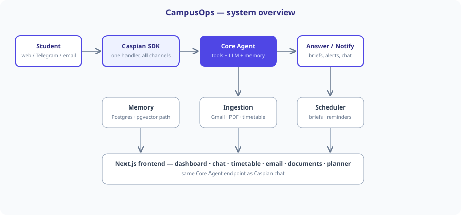

<p align="center">
  
</p>

<h1 align="center">CampusOps</h1>
<p align="center"><strong>Your personal academic agent</strong> — never miss a class, deadline, or room change again.</p>

<p align="center">
  
  
  
  
  
</p>

CampusOps reads your **college email, timetable, and documents** — then pings you
with a morning brief, urgent alerts, and answers. One Core Agent brain serves
**web chat, Telegram, and email** alike.

<p align="center"></p>

## ✨ Highlights

- 🎯 **"Do now" focus engine** — urgency-ranked deadlines + next class in one answer
- 🗓️ **Your timetable, your rules** — batch-filtered views, PDF/photo scan, hide/mute/delete by chat
- 📧 **Email intelligence** — Gmail sync, 10-kind classification, room-change radar
- 📄 **Documents that answer back** — multiformat + vision OCR + hybrid search
- 🔔 **Notifications with rules** — kinds, quiet hours, channel choice, honest statuses
- 💬 **Telegram bot** — commands, quick-action buttons, first-time guide
- 🔌 **Connection board** — every integration 🟢/🔴 with the fix, right in Settings

Full tour: [`docs/FEATURES.md`](docs/FEATURES.md) · User manual: [`docs/USER_GUIDE.md`](docs/USER_GUIDE.md)

## 🚀 Quickstart

```powershell
python -m scripts.init_db --seed
python -m uvicorn backend.app.main:app --port 8000   # API + /docs
python -m backend.app.jobs.worker                     # scheduler (another shell)
cd frontend; npm install; npm run dev                 # web UI :3001
```

Sample login: `demo.student@example.com` / `demo1234` · Ports: API `:8000`, web `:3001`

## 🌐 Live deployment (Vercel + Render, free)

Frontend on Vercel, backend + worker + Postgres on Render — full click-by-click
guide: [`docs/DEPLOYMENT.md`](docs/DEPLOYMENT.md). After deploying, put the URLs
here:

- **Live app:** _TODO: paste Vercel URL_
- **API docs:** _TODO: paste Render API `/docs` URL_

Live channels need keys (`.env.example` documents all): `CASPIAN_API_KEY` +
`CAMPUSOPS_MAILBOX` for email, `TELEGRAM_BOT_TOKEN` for the bot, Google OAuth
client for Gmail + Google sign-in. Everything else works offline.

## 🧠 Conversational agent (not templates)

Every reply is composed live by the model from three inputs: a per-turn
**user card** (your name, batch, today's classes, deadlines, memories —
see [`docs/USER_CARD_SPEC.md`](docs/USER_CARD_SPEC.md)), only the facts the
question needs, and the last 6 turns of conversation. Greetings and action
confirmations answer instantly; everything else is voiced fresh each time.
Design: [`docs/AGENT.md`](docs/AGENT.md).

## 📚 Docs

| Doc | Covers |
|---|---|
| [`docs/USER_GUIDE.md`](docs/USER_GUIDE.md) | End-user manual (also served in-app at Help) |
| [`docs/USER_CARD_SPEC.md`](docs/USER_CARD_SPEC.md) | User-card markdown contract for the system prompt |
| [`docs/AGENT.md`](docs/AGENT.md) | Conversational pipeline: retrieve → compose → fallback |
| [`docs/PROJECT_REPORT.md`](docs/PROJECT_REPORT.md) | Full audit: features, verification, limits |
| [`docs/BACKEND.md`](docs/BACKEND.md) | Service layout, DB/migrations, auth model |
| [`docs/FRONTEND.md`](docs/FRONTEND.md) | Pages, conventions, build |
| [`docs/API.md`](docs/API.md) | Every endpoint + auth |
| [`docs/ERROR_HANDLING.md`](docs/ERROR_HANDLING.md) | Codes, limits, failure table |
| [`docs/FEATURES.md`](docs/FEATURES.md) | Feature tour |
| [`docs/DEPLOYMENT.md`](docs/DEPLOYMENT.md) | Docker, env checklist, Google/Telegram/Caspian setup |
| [`docs/00-caspian-capability-map.md`](docs/00-caspian-capability-map.md) | Verified Caspian SDK capabilities |
| [`docs/01-architecture.md`](docs/01-architecture.md) | Caspian-first architecture |
| [`CONTRIBUTORS.md`](CONTRIBUTORS.md) | Contributors |

## ✅ Verify

```powershell
python -m pytest backend/tests/ -v   # 62 tests, offline-safe
cd frontend; npx tsc --noEmit; npm run build
```

## 🔒 Production notes (honest limits)

- Semantic recall uses portable hash embeddings + in-Python cosine search so the
  demo runs anywhere; swap `embeddings.embed()` for a real model and move
  `embedding_json` to a pgvector column for scale (compose ships `pgvector/pg16`).
- Gmail uses read-only OAuth with auto token refresh; refresh tokens live in
  `integrations` — put a KMS/vault in front of the DB before real student data.
- Set a long random `APP_SECRET_KEY`; never commit `.env`.
- Moodle/WhatsApp are new `InformationSource` implementations, not core rewrites.

## ✈️ Telegram flagship

The fastest way to feel CampusOps: message **[@Sankiyy_bot](https://t.me/Sankiyy_bot)**.
First contact gets a guided tour + onboarding in chat; then:

- ⌨️ **10 slash commands** — type `/` for today, tomorrow, week, next, deadlines,
  exams, reminders, brief, focus, help
- 👆 **4 tap buttons** under every reply (Today · Next · Deadlines · Focus)
- 💬 **Short personal answers** voiced live from your user card + history
- 🔔 **Proactive pings** — class-start (~15 min), deadline, exam, and room-change alerts

One runner only: `TELEGRAM_SELF_HOST=1 python -m backend.app.comms.runner`
(the runner clears webhooks and publishes the `/` menu on start).

## 👥 Team

- **Sanskar** — owner · [GitHub](https://github.com/Sanskar1724)
- **Pratiksha** — contributor · [GitHub](https://github.com/Pratiksha2968)

Full credits: [CONTRIBUTORS.md](CONTRIBUTORS.md).
